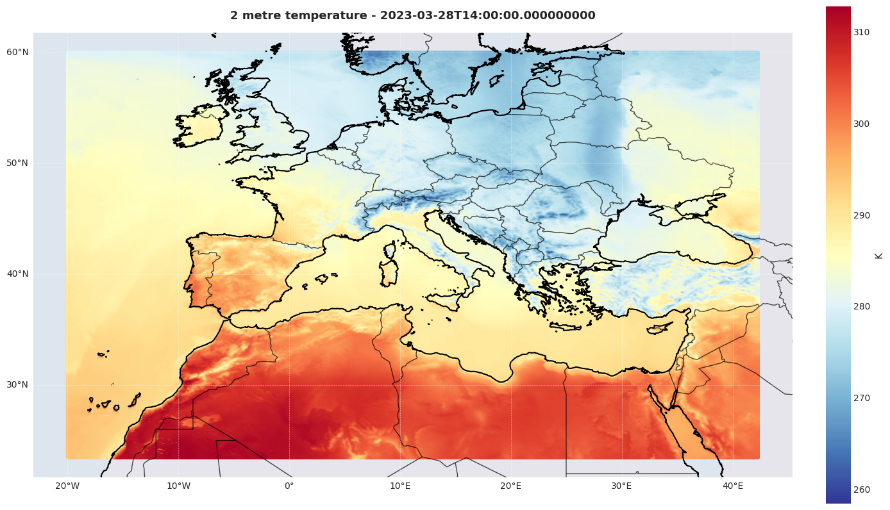

# CHAPTER Reanalysis Conversion Pipeline

This pipeline converts the CHAPTER (Computational Hydrometeorology with Advanced Performance to Enhanced Realism) reanalysis output from WRF to ECMWF-compatible GRIB1 format and Anemoi-ready datasets.




## Overview

CHAPTER is a high-resolution (3 km) regional reanalysis over Europe and the Mediterranean basin using the WRF model, described in:

> Bernini, L., Lagasio, M., Milelli, M., Oberto, E., Parodi, A., Hachinger, S., Kranzlmüller, D., & Tartaglione, N. (2024). **Convection-permitting dynamical downscaling of ERA5 for Europe and the Mediterranean basin**. *Quarterly Journal of the Royal Meteorological Society*. https://doi.org/10.1002/qj.5014

This pipeline performs two main conversions:

1. **WRF → GRIB1**: Convert CHAPTER WRF output to ECMWF-compatible GRIB1 format using [wrf-python](https://wrf-python.readthedocs.io/en/latest/) for vertical interpolation to pressure levels and derived variable calculations, then eccodes for GRIB1 encoding with proper variable mapping and unit conversions
2. **WRF → Anemoi ZARR**: Convert to Anemoi machine learning framework format using the official [anemoi-datasets](https://anemoi.readthedocs.io/projects/datasets/en/latest/) package

## CHAPTER Reanalysis Characteristics

- **Domain**: Europe and Mediterranean basin
- **Resolution**: 3 km horizontal, 50 vertical levels
- **Projection**: Mercator (MAP_PROJ=3)
- **Model**: WRF (Weather Research and Forecasting)
- **Period**: Multi-year climatological reanalysis
- **Grid**: 1353×1641 points (Mercator projection)

## Files

### Main Conversion Scripts
- `convert_to_pressure_levels.py` - Converts CHAPTER WRF output to pressure levels in GRIB1 format
- `wrf_era5_comparison.py` - WRF to ECMWF variable mapping and paramId definitions
- `wrf_anemoi_recipe.yaml` - Anemoi dataset recipe configuration
- `run_anemoi_pipeline.sh` - Anemoi pipeline automation script
- `meteoswiss_variable_comparison.md` - Column-by-column comparison of the MeteoSwiss/ERA5/COSMO
  variable lists vs the pipeline output (what is selected, disabled, or supplied by Anemoi forcings)

### HPC Pipeline (Leonardo ↔ SuperMUC)
- `hpc/submit_pipeline.py` - Orchestrator: submits SLURM fetch+convert jobs per day over a date range
- `hpc/fetch_day.sh` - SLURM job: rsync 24 hourly wrfout files from SuperMUC via SSH control socket
- `hpc/convert_day.sh` - SLURM array job (0-23): convert each hour's wrfout to GRIB, delete wrfout on success
- `hpc/orchestrator.sh` - SLURM wrapper for submit_pipeline.py in worker mode
- `hpc/dates.py` - Date-to-run-folder mapping (target date → SuperMUC init folder with 6h spinoff)
- `conf/pipeline.yaml` - Hydra configuration (date range, paths, SuperMUC settings, SLURM parameters)
- `functions_supermuc.sh` - Shell helper functions for rsync transfers via SSH control socket

### Visualization
- `plot_anemoi_zarr.ipynb` - Visualize Anemoi ZARR datasets
- `plot_grib_output.ipynb` - Visualize and validate GRIB1 output files

### Build Dependencies
- `fortran/` - WRF-Python computational extensions (Fortran source)
- `src/` - Python wrappers and C extensions for WRF diagnostics
- `CMakeLists.txt` - Build configuration for wrf-python compilation via uv


## Prerequisites

### Python Environment

This project uses [uv](https://docs.astral.sh/uv/) for dependency management. Initialize and sync the environment:

```bash
uv sync
```

This installs all dependencies defined in `pyproject.toml`, including:
- Core: numpy, netCDF4, pandas, xarray
- WRF processing: wrf-python
- GRIB encoding: eccodes, cfgrib
- HPC pipeline: hydra-core, omegaconf
- Visualization: matplotlib, cartopy
- ML framework: anemoi-datasets

### System Requirements
- eccodes library for GRIB encoding
- WRF output files from CHAPTER reanalysis

## Usage

### Workflow 1: CHAPTER → GRIB1 (ECMWF Format)

Convert CHAPTER WRF output to ECMWF-compatible GRIB1 format with proper projection and variable mapping.

```bash
uv run convert_to_pressure_levels.py
```

**Input**: CHAPTER WRF native files
- `wrfout_d02_2023-03-28_HH:00:00` (Mercator projection, model levels)

**Output**: GRIB1 files with ECMWF paramIds
- `output/ailam-an-cima-3km-2023-2023-1h-v1-YYYYMMDDHH.grib`

**Features**:
- Interpolation to 13 pressure levels (1000-50 hPa)
- Mercator projection encoding with proper grid parameters
- ECMWF paramId mapping (table 128)
- Unit conversions (geopotential, radiation, precipitation)
- **Lossless GRIB1 second-order packing** (~37% smaller: ≈590 → ≈370 MB/timestep, bit-identical)
- Bitmap support for missing values; ocean masking for SST via LANDMASK (when SST enabled)
- Derived variables: specific humidity, TCW (total column water), **TQV** (total column water
  vapour), **TCC** (total cloud cover, maximum-random overlap of CLDFRA), skin temperature
  (Stefan-Boltzmann inversion of LWUPB), slope of orography
- Variable selection aligned to the MeteoSwiss/COSMO training lists — see
  [meteoswiss_variable_comparison.md](meteoswiss_variable_comparison.md)

**Key Variables** (active set):
- **3D (pressure levels)**: t, u, v, w, z, q
- **2D surface**: 2t, 2d, sp, msl, skt, 10u, 10v, tp, tcw, tcwv (tqv), tcc
- **Static**: z (orography), lsm, sdor, slor
- **Disabled** (commented in `wrf_era5_comparison.py`, re-enable by uncommenting): cc, r, pv,
  pt/theta, sst, ci, slt, strd, ssrd, 2m specific humidity

### Workflow 2: CHAPTER → Anemoi ZARR (ML Framework)

Convert CHAPTER WRF output to Anemoi machine learning framework format.


```bash
./run_anemoi_pipeline.sh
```

Or with custom arguments:

```bash
./run_anemoi_pipeline.sh wrf_anemoi_recipe.yaml output_dataset.zarr
```

This will:
1. **Create the dataset** using `anemoi-datasets create`
   - Reads Grib1 files following the wildcard pattern
   - Combines multiple timesteps along time dimension
   - Computes statistics automatically
   - Writes optimized Zarr format
   
2. **Inspect the dataset** using `anemoi-datasets inspect`
   - Shows dimensions, variables, statistics
   - Validates CF-compliance
   - Reports any issues

### Workflow 3: HPC Pipeline (Leonardo ↔ SuperMUC)

Batch-process date ranges on Leonardo by fetching wrfout files from SuperMUC and converting them to GRIB1 via SLURM jobs.

**Prerequisites**: SSH control socket must be pre-activated in a tmux session:
```bash
ssh -fNM -S /tmp/skt-di54coy supermuc
```

**Submit the pipeline:**
```bash
python hpc/submit_pipeline.py                                            # uses conf/pipeline.yaml defaults
python hpc/submit_pipeline.py dates.start=2023-03-01 dates.end=2023-03-31  # Hydra CLI overrides
python hpc/submit_pipeline.py slurm.account=my_project                   # specify SLURM account
python hpc/submit_pipeline.py --worker                                   # run submission loop directly (no SLURM self-submit)
```

**Pipeline flow** (per day):
1. **Fetch** (lrd_all_serial): rsync 24 hourly wrfout files from SuperMUC
2. **Convert** (array job 0-23, depends on fetch): convert each hour to GRIB1, delete wrfout on success

The pipeline is **re-entrant**: dates with all 24 GRIBs present are skipped, and individual convert tasks skip if the output already exists.

**Configuration** (`conf/pipeline.yaml`): date range, Leonardo paths, SuperMUC remote settings, SLURM partitions/walltimes, GRIB filename template. All values can be overridden via Hydra CLI.

**Monitor:**
```bash
squeue -u $USER
```

### Workflow 4: Step-by-step Pipeline via Datamover (Leonardo ↔ chapteradmin VM)

Process an **hourly time window** by fetching wrfout files through the **CINECA datamover**
(`data.leonardo.cineca.it`). **Run it from a regular login node:** the datamover is reachable only
from login nodes, **not** from `lrd_all_serial` or compute nodes. The fetch driver runs on the login
node; the GRIB conversion runs as a SLURM job on `dcgp_usr_prod`.

```bash
# Run from a login node (the launcher refuses to start where the datamover is unreachable):
python hpc/submit_step_pipeline.py \
    window.start_date=2025-06-01 window.start_hour=0 \
    window.end_date=2025-06-30  window.end_hour=23
# By default direction=backward: the run starts at the NEWEST edge (2025-06-30 23Z)
# and walks back to the oldest, so the most recent GRIBs are produced first.
# convert jobs charge slurm.step_convert_account (default aifpt_ailamit_0, the DCGP association).
# Stop the whole chain with:  pkill -f hpc/fetch_step.sh
```

Preview everything (fetch/convert/respawn commands) **without** network — useful while LRZ is
unavailable:
```bash
python hpc/submit_step_pipeline.py window.start_date=2025-06-30 window.start_hour=14 \
    window.end_date=2025-06-30 window.end_hour=23 batch.size=5 dry_run=true
```

**Flow** (`hpc/submit_step_pipeline.py` → `hpc/fetch_step.sh` → `hpc/convert_step.sh`):
1. The launcher TCP-probes the datamover, then launches the **driver detached on the login node**
   (`fetch_step.sh`), starting at the newest edge (backward) or oldest edge (forward) per
   `pipeline.direction`.
2. The driver fetches timesteps until its wall-time budget (`pipeline.driver_max_seconds`, default
   ~18 min — login-node processes are killed past ~30 min) or `batch.size`, whichever first. Per step:
   - skips it if the output GRIB already exists (re-entrant);
   - fetches the wrfout via `ssh -xT data.leonardo.cineca.it "scp -F <cfg> supermuc-vm:<remote> <local>/"`
     (wrapped in `timeout`, with `datamover.fetch_retries`; up to `batch.fetch_parallel` in flight);
   - validates the file is a readable NetCDF (size + header open);
   - submits a single-timestep **convert** job on `dcgp_usr_prod` (independent, runs in parallel).
3. When the budget/batch is hit, the driver **re-spawns itself detached** (`setsid`) — a fresh process
   with a fresh ~30-min clock — continuing until the window edge.

**Status ledger & missing/tape handling.** Every timestep's outcome is appended to
`paths.status_log` (`…/logs/step_pipeline_status.log`), e.g.:
```
2025-...Z | 2025-06-30T23 | FETCH_OK | size=...B
2025-...Z | 2025-06-30T23 | CONVERT_SUBMITTED | job=...
2025-...Z | 2025-06-30T20 | MISSING_ON_LRZ | scp: ...: No such file or directory
2025-...Z | 2025-06-30T19 | TAPE_TIMEOUT | scp exceeded 600s; file likely migrated to tape -> ask LRZ to recall
2025-...Z | 2025-06-30T18 | UNREADABLE_TAPE | size=...B not a readable NetCDF; likely tape stub/truncated
```
A missing or on-tape file is **logged and skipped, never fatal** — the chain keeps going. On LRZ,
files may be migrated to tape: visible on the filesystem but not staged, so the wrfout is unreadable.
These surface as `TAPE_TIMEOUT` / `UNREADABLE_TAPE` / `FETCH_ERROR`. Ask LRZ to recall them, then
re-run the same window (re-entrant: only timesteps without a GRIB are re-fetched).

Consolidated, read-only status report (DONE / GRIB_MISSING / RECALL, with the recall list):
```bash
python hpc/submit_step_pipeline.py window.start_date=2025-06-01 window.start_hour=0 \
    window.end_date=2025-06-30 window.end_hour=23 report=true
```

Init-folder mapping reuses the previous-day/18Z convention (`hpc/dates.py`), e.g. target
`2025-06-30 00Z` → `…/CHAPTER-23-25/2025062918/wrfout_d02_2025-06-30_00:00:00`. The datamover/VM
paths (`datamover.*`) are configured separately from the rsync/DSS paths (`supermuc.*`).
The driver on `lrd_all_serial` needs no account; convert jobs on `dcgp_usr_prod` charge
`slurm.step_convert_account` (default `aifpt_ailamit_0`).

## Variables Included (ECMWF parameter table 128)

The active set is aligned to the variables used by the MeteoSwiss/COSMO training lists. See
[meteoswiss_variable_comparison.md](meteoswiss_variable_comparison.md) for the full
column-by-column comparison, the derivation of each field, and the rationale for what was
enabled/disabled.

### Atmospheric 3D (13 pressure levels, 1000-50 hPa)
- `t`, `q` - Temperature, specific humidity
- `z` - Geopotential
- `u`, `v`, `w` - Wind components

### Surface / single-level 2D
- `2t`, `2d` - 2m temperature and dewpoint
- `10u`, `10v` - 10m wind
- `sp`, `msl` - Surface and mean-sea-level pressure
- `skt` - Skin temperature (Stefan-Boltzmann inversion of `LWUPB`, ε=0.98)
- `tp` - Total precipitation (grid-scale, `RAINNC`)
- `tcw` - Total column water (vapour + all hydrometeors)
- `tcwv` (`tqv`) - Total column water vapour (vertical integral of `QVAPOR`)
- `tcc` - Total cloud cover (maximum-random overlap of `CLDFRA`)

### Static fields
- `z` - Terrain height (geopotential)
- `lsm` - Land-sea mask
- `sdor`, `slor` - Orographic parameters

### Disabled (commented out — re-enable in `wrf_era5_comparison.py`)
Not present in any MeteoSwiss/ERA5/COSMO list, so disabled to keep GRIBs lean:
`cc` (cloud fraction per level), `r` (relative humidity), `pt`/`theta` (potential temperature),
`pv` (potential vorticity), `sst`, `ci` (sea ice), `slt` (soil type), `strd`/`ssrd` (downward
radiation), 2m specific humidity.

### Forcings (added by Anemoi, not by the GRIB conversion)
The temporal/positional features used in training (`cos/sin_latitude`, `cos/sin_longitude`,
`cos/sin_julian_day`, `cos/sin_local_time`, `insolation`) are **not** encoded in GRIB. They are
generated at dataset build time via a `forcings` source in the Anemoi recipe `input`:

```yaml
input:
  join:
    - grib: { path: output/ailam-an-cima-3km-*.grib }
    - forcings:
        template: ${input.join.0.grib}
        param: [cos_latitude, sin_latitude, cos_longitude, sin_longitude,
                cos_julian_day, sin_julian_day, cos_local_time, sin_local_time, insolation]
```


## References

### CHAPTER Reanalysis
- Bernini, L., Lagasio, M., Milelli, M., Oberto, E., Parodi, A., Hachinger, S., Kranzlmüller, D., & Tartaglione, N. (2024). **Convection-permitting dynamical downscaling of ERA5 for Europe and the Mediterranean basin**. *Quarterly Journal of the Royal Meteorological Society*. https://doi.org/10.1002/qj.5014

### Anemoi Framework
- [Anemoi Datasets Documentation](https://anemoi.readthedocs.io/projects/datasets/)
- [Creating Datasets Guide](https://anemoi.readthedocs.io/projects/datasets/en/latest/building/introduction.html)
- [Recipe Examples](https://anemoi.readthedocs.io/projects/datasets/en/latest/howtos/create/)
- [CLI Reference](https://anemoi.readthedocs.io/projects/datasets/en/latest/cli/introduction.html)

### ECMWF GRIB
- [ECMWF Parameter Database](https://codes.ecmwf.int/grib/param-db/)
- [eccodes Documentation](https://confluence.ecmwf.int/display/ECC/ecCodes+Home)
