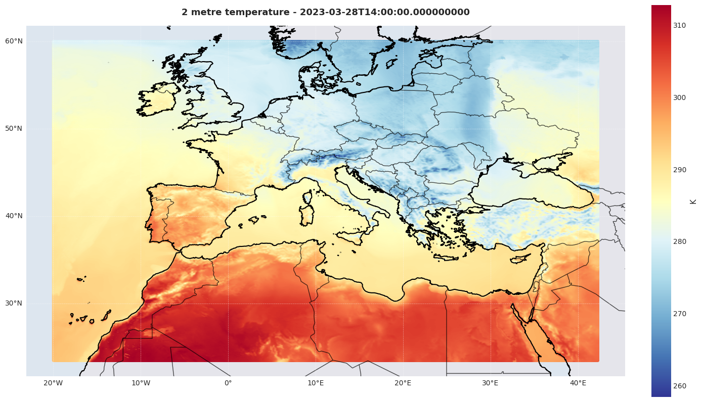

# CHAPTER Reanalysis Conversion Pipeline

This pipeline converts the CHAPTER (Computational Hydrometeorology with Advanced Performance to Enhanced Realism) reanalysis output from WRF to ECMWF-compatible GRIB2 format and Anemoi-ready datasets.




## Overview

CHAPTER is a high-resolution (3 km) regional reanalysis over Europe and the Mediterranean basin using the WRF model, described in:

> Bernini, L., Lagasio, M., Milelli, M., Oberto, E., Parodi, A., Hachinger, S., Kranzlmüller, D., & Tartaglione, N. (2024). **Convection-permitting dynamical downscaling of ERA5 for Europe and the Mediterranean basin**. *Quarterly Journal of the Royal Meteorological Society*. https://doi.org/10.1002/qj.5014

This pipeline performs two main conversions:

1. **WRF → GRIB2**: Convert CHAPTER WRF output to ECMWF-compatible GRIB2 format using [wrf-python](https://wrf-python.readthedocs.io/en/latest/) for vertical interpolation to pressure levels and derived variable calculations, then eccodes for GRIB2 encoding with proper variable mapping and unit conversions
2. **WRF → Anemoi ZARR**: Convert to Anemoi machine learning framework format using the official [anemoi-datasets](https://anemoi.readthedocs.io/projects/datasets/en/latest/) package

## CHAPTER Reanalysis Characteristics

- **Domain**: Europe and Mediterranean basin
- **Resolution**: 3 km horizontal, 50 vertical levels
- **Projection**: Mercator (MAP_PROJ=3)
- **Model**: WRF (Weather Research and Forecasting)
- **Period**: Multi-year climatological reanalysis
- **Grid**: 1353×1641 points (Mercator projection)

## Files

### Main Conversion Scripts
- `convert_to_pressure_levels.py` - Converts CHAPTER WRF output to pressure levels in GRIB2 format
- `wrf_era5_comparison.py` - WRF to ECMWF variable mapping and paramId definitions
- `wrf_anemoi_recipe.yaml` - Anemoi dataset recipe configuration
- `run_anemoi_pipeline.sh` - Anemoi pipeline automation script
- `meteoswiss_variable_comparison.md` - Column-by-column comparison of the MeteoSwiss/ERA5/COSMO
  variable lists vs the pipeline output (what is selected, disabled, or supplied by Anemoi forcings)

### HPC Pipeline (Leonardo ↔ SuperMUC)
- `hpc/submit_pipeline.py` - Orchestrator: submits SLURM fetch+convert jobs per day over a date range
- `hpc/fetch_day.sh` - SLURM job: rsync 24 hourly wrfout files from SuperMUC via SSH control socket
- `hpc/convert_day.sh` - SLURM array job (0-23): convert each hour's wrfout to GRIB, delete wrfout on success
- `hpc/orchestrator.sh` - SLURM wrapper for submit_pipeline.py in worker mode
- `hpc/dates.py` - Date-to-run-folder mapping (target date → SuperMUC init folder with 6h spinoff)
- `conf/pipeline.yaml` - Hydra configuration (date range, paths, SuperMUC settings, SLURM parameters)
- `functions_supermuc.sh` - Shell helper functions for rsync transfers via SSH control socket

### Visualization
- `plot_anemoi_zarr.ipynb` - Visualize Anemoi ZARR datasets
- `plot_grib_output.ipynb` - Visualize and validate GRIB output files

### Build Dependencies
- `fortran/` - WRF-Python computational extensions (Fortran source)
- `src/` - Python wrappers and C extensions for WRF diagnostics
- `CMakeLists.txt` - Build configuration for wrf-python compilation via uv


## Prerequisites

### Python Environment

This project uses [uv](https://docs.astral.sh/uv/) for dependency management. Initialize and sync the environment:

```bash
uv sync
```

This installs all dependencies defined in `pyproject.toml`, including:
- Core: numpy, netCDF4, pandas, xarray
- WRF processing: wrf-python
- GRIB encoding: eccodes, cfgrib
- HPC pipeline: hydra-core, omegaconf
- Visualization: matplotlib, cartopy
- ML framework: anemoi-datasets

### System Requirements
- eccodes library for GRIB encoding
- WRF output files from CHAPTER reanalysis

## Usage

### Workflow 1: CHAPTER → GRIB2 (ECMWF Format)

Convert CHAPTER WRF output to ECMWF-compatible GRIB2 format with proper projection and variable mapping.

```bash
uv run convert_to_pressure_levels.py
```

**Input**: CHAPTER WRF native files
- `wrfout_d02_2023-03-28_HH:00:00` (Mercator projection, model levels)

**Output**: GRIB2 files with ECMWF paramIds (tree `grib_v3/`)
- `output/ailam-an-cima-3km-2023-2023-1h-v1-YYYYMMDDHH.grib`

**Features**:
- Interpolation to 13 pressure levels (1000-50 hPa)
- Mercator projection encoding with proper grid parameters
- ECMWF paramId mapping (table 128)
- Unit conversions (geopotential, radiation, precipitation)
- **`grid_ccsds` packing** (≈747 MB/timestep for the 246-message schema, ≈6.55 TB/year)
- WRF's sphere declared in the GRIB (`shapeOfTheEarth=1`, radius 6370000 m), without which
  eccodes derives a grid off by ~1.1 km at the northern edge
- Bitmap support for missing values; ocean masking via LANDMASK
- Derived variables: specific humidity, TCW (total column water), **TQV** (total column water
  vapour), **TCC** (total cloud cover, maximum-random overlap of CLDFRA), skin temperature
  (Stefan-Boltzmann inversion of LWUPB, with the per-category emissivity measured from the run),
  slope of orography

**Key Variables**: 90 variables in 246 messages per timestep — 13 on 13 pressure levels plus
77 single-level. The registry `wrf_era5_comparison.WRF_TO_ECMWF_PARAMID` is the only place the
set is defined, and [CHAPTER_VARIABLES.md](CHAPTER_VARIABLES.md) documents it in full. See
[Variables Included](#variables-included-ecmwf-parameter-table-128) below.

### Workflow 2: CHAPTER → Anemoi ZARR (ML Framework)

Convert CHAPTER WRF output to Anemoi machine learning framework format.


```bash
./run_anemoi_pipeline.sh
```

Or with custom arguments:

```bash
./run_anemoi_pipeline.sh wrf_anemoi_recipe.yaml output_dataset.zarr
```

This will:
1. **Create the dataset** using `anemoi-datasets create`
   - Reads Grib1 files following the wildcard pattern
   - Combines multiple timesteps along time dimension
   - Computes statistics automatically
   - Writes optimized Zarr format
   
2. **Inspect the dataset** using `anemoi-datasets inspect`
   - Shows dimensions, variables, statistics
   - Validates CF-compliance
   - Reports any issues

### Workflow 3: HPC Pipeline (Leonardo ↔ SuperMUC)

Batch-process date ranges on Leonardo by fetching wrfout files from SuperMUC and converting them to GRIB2 via SLURM jobs.

**Prerequisites**: SSH control socket must be pre-activated in a tmux session:
```bash
ssh -fNM -S /tmp/skt-di54coy supermuc
```

**Submit the pipeline:**
```bash
python hpc/submit_pipeline.py                                            # uses conf/pipeline.yaml defaults
python hpc/submit_pipeline.py dates.start=2023-03-01 dates.end=2023-03-31  # Hydra CLI overrides
python hpc/submit_pipeline.py slurm.account=my_project                   # specify SLURM account
python hpc/submit_pipeline.py --worker                                   # run submission loop directly (no SLURM self-submit)
```

**Pipeline flow** (per day):
1. **Fetch** (lrd_all_serial): rsync 24 hourly wrfout files from SuperMUC
2. **Convert** (array job 0-23, depends on fetch): convert each hour to GRIB2, delete wrfout on success

The pipeline is **re-entrant**: dates with all 24 GRIBs present are skipped, and individual convert tasks skip if the output already exists.

**Configuration** (`conf/pipeline.yaml`): date range, Leonardo paths, SuperMUC remote settings, SLURM partitions/walltimes, GRIB filename template. All values can be overridden via Hydra CLI.

**Monitor:**
```bash
squeue -u $USER
```

### Workflow 4: Step-by-step Pipeline via Datamover (Leonardo ↔ LRZ data relay)

Process an **hourly time window** by fetching wrfout files through the **CINECA datamover**
(`data.leonardo.cineca.it`). **Run it from a regular login node:** the datamover is reachable only
from login nodes, **not** from `lrd_all_serial` or compute nodes. The fetch driver runs on the login
node; the GRIB conversion runs as a SLURM job on `dcgp_usr_prod`.

```bash
# Run from a login node (the launcher refuses to start where the datamover is unreachable):
python hpc/submit_step_pipeline.py \
    window.start_date=2025-06-01 window.start_hour=0 \
    window.end_date=2025-06-30  window.end_hour=23
# By default direction=backward: the run starts at the NEWEST edge (2025-06-30 23Z)
# and walks back to the oldest, so the most recent GRIBs are produced first.
# convert jobs charge slurm.step_convert_account (default aifpt_ailamit_0, the DCGP association).
# Stop the whole chain with:  touch <log_dir>/fetch_step.stop   (paths.stop_flag)
# The driver checks that flag between timesteps and before every respawn. Use it, not
# pkill: the driver respawns on ONE login node and pkill only sees your own node.
```

Preview everything (fetch/convert/respawn commands) **without** network — useful while LRZ is
unavailable:
```bash
python hpc/submit_step_pipeline.py window.start_date=2025-06-30 window.start_hour=14 \
    window.end_date=2025-06-30 window.end_hour=23 batch.size=5 dry_run=true
```

**Flow** (`hpc/submit_step_pipeline.py` → `hpc/fetch_step.sh` → `hpc/convert_step.sh`):
1. The launcher TCP-probes the datamover, then launches the **driver detached on the login node**
   (`fetch_step.sh`), starting at the newest edge (backward) or oldest edge (forward) per
   `pipeline.direction`.
2. The driver fetches timesteps until its wall-time budget (`pipeline.driver_max_seconds`, default
   ~18 min — login-node processes are killed past ~30 min) or `batch.size`, whichever first. Per step:
   - skips it if the output GRIB already exists (re-entrant);
   - fetches the wrfout via `ssh -xT data.leonardo.cineca.it "sftp -i <key> -B 262144 -R 256 -p datarelay@rdmtests.srv.lrz.de:<remote> <local>/"`
     (wrapped in `timeout`, with `datamover.fetch_retries`; up to `batch.fetch_parallel` in flight);
   - validates the file is a readable NetCDF (size + header open);
   - submits a single-timestep **convert** job on `dcgp_usr_prod` (independent, runs in parallel).
3. When the budget/batch is hit, the driver **re-spawns itself detached** (`setsid`) — a fresh process
   with a fresh ~30-min clock — continuing until the window edge.

**Status ledger & missing/tape handling.** Every timestep's outcome is appended to
`paths.status_log` (`…/logs/step_pipeline_status.log`), e.g.:
```
2025-...Z | 2025-06-30T23 | FETCH_OK | size=...B
2025-...Z | 2025-06-30T23 | CONVERT_SUBMITTED | job=...
2025-...Z | 2025-06-30T20 | MISSING_ON_LRZ | File "..." not found.
2025-...Z | 2025-06-30T19 | FETCH_TIMEOUT | sftp exceeded 600s; usually congestion, occasionally tape -> recall if it persists
2025-...Z | 2025-06-30T18 | UNREADABLE | size=...B not a readable NetCDF; truncated transfer or tape stub
```
A missing or on-tape file is **logged and skipped, never fatal** — the chain keeps going. On LRZ,
files may be migrated to tape: visible on the filesystem but not staged, so the wrfout is unreadable.
These surface as `FETCH_TIMEOUT` / `UNREADABLE` / `FETCH_ERROR`. Ask LRZ to recall them, then
re-run the same window (re-entrant: only timesteps without a GRIB are re-fetched).

Consolidated, read-only status report (DONE / GRIB_MISSING / RECALL, with the recall list):
```bash
python hpc/submit_step_pipeline.py window.start_date=2025-06-01 window.start_hour=0 \
    window.end_date=2025-06-30 window.end_hour=23 report=true
```

Init-folder mapping reuses the previous-day/18Z convention (`hpc/dates.py`), e.g. target
`2025-06-30 00Z` → `…/CHAPTER-23-25/2025062918/wrfout_d02_2025-06-30_00:00:00`. The datamover/relay
paths (`datamover.*`) are configured separately from the rsync/DSS paths (`supermuc.*`).
The driver on `lrd_all_serial` needs no account; convert jobs on `dcgp_usr_prod` charge
`slurm.step_convert_account` (default `aifpt_ailamit_0`).

## Variables Included (ECMWF parameter table 128)

**90 variables, 246 GRIB messages per timestep.** The set is defined in exactly one place, the
registry `wrf_era5_comparison.WRF_TO_ECMWF_PARAMID`; `EXPECTED_MESSAGES` is derived from it and
`hpc/check_grib_sanity.py` enforces it, so a field that silently fails to compute cannot slip
into the archive.

[**CHAPTER_VARIABLES.md**](CHAPTER_VARIABLES.md) is the reference for consumers of the archive:
every variable with its paramId, units and derivation, the time convention, the declared
approximations, the masked fields, and what is deliberately absent. Do not restate that list
here — this section is a map, not a copy.

### Pressure levels (13 levels, 1000-50 hPa) — 13 variables, 169 messages
`t`, `q`, `r`, `z`, `u`, `v`, `w` (Pa/s) and `wz` (m/s), plus the hydrometeor and cloud fields
`cc`, `clwc`, `ciwc`, `crwc`, `cswc`.

### Single level — 77 variables, 77 messages
Grouped in CHAPTER_VARIABLES.md §7 as height above ground (11), mean sea level (1), total
column (10), surface / single level (47), entire lake (1) and top of atmosphere / most unstable
parcel (7). Among them the 19 accumulated fields (precipitation, runoff, the full radiation
set), the soil columns `swvl1-4` / `stl1-4`, and the seven fields read from the `geo_em.d02`
sidecar — `cvl`, `cvh`, `tvl`, `tvh`, `slt`, `cl`, `dl` — which are the only ones invariant
across the whole archive. `lsm` and `al` are **not**: WRF reclassifies sea-ice points at
runtime, so both move.

### Accumulations and time convention
Accumulated fields are referred to **00Z of the same day**, not to run init, and carry
`generatingProcessIdentifier=128`. They use product definition template 8, so their reference
time is 00Z and their step is `0-H` while the instantaneous fields carry the valid time
directly. **Index the archive on validity, never on `dataTime`.** CHAPTER_VARIABLES.md §3 has
the details.

### Not in the archive
`MISSING_VARIABLES.md` records what cannot be produced from these wrfout at all (no TKE, no
PBLH, no ocean coupling, no `TSK`/`HFX`/`LH`), and why. CHAPTER_VARIABLES.md §6 records what is
present in the wrfout but deliberately unpublished. Read one of them before promising a field.

The historical comparison against the MeteoSwiss/COSMO training lists, which drove the original
GRIB1 selection, is in
[meteoswiss_variable_comparison.md](meteoswiss_variable_comparison.md).

### Forcings (added by Anemoi, not by the GRIB conversion)
The temporal/positional features used in training (`cos/sin_latitude`, `cos/sin_longitude`,
`cos/sin_julian_day`, `cos/sin_local_time`, `insolation`) are **not** encoded in GRIB. They are
generated at dataset build time via a `forcings` source in the Anemoi recipe `input`:

```yaml
input:
  join:
    - grib: { path: output/ailam-an-cima-3km-*.grib }
    - forcings:
        template: ${input.join.0.grib}
        param: [cos_latitude, sin_latitude, cos_longitude, sin_longitude,
                cos_julian_day, sin_julian_day, cos_local_time, sin_local_time, insolation]
```


## References

### CHAPTER Reanalysis
- Bernini, L., Lagasio, M., Milelli, M., Oberto, E., Parodi, A., Hachinger, S., Kranzlmüller, D., & Tartaglione, N. (2024). **Convection-permitting dynamical downscaling of ERA5 for Europe and the Mediterranean basin**. *Quarterly Journal of the Royal Meteorological Society*. https://doi.org/10.1002/qj.5014

### Anemoi Framework
- [Anemoi Datasets Documentation](https://anemoi.readthedocs.io/projects/datasets/)
- [Creating Datasets Guide](https://anemoi.readthedocs.io/projects/datasets/en/latest/building/introduction.html)
- [Recipe Examples](https://anemoi.readthedocs.io/projects/datasets/en/latest/howtos/create/)
- [CLI Reference](https://anemoi.readthedocs.io/projects/datasets/en/latest/cli/introduction.html)

### ECMWF GRIB
- [ECMWF Parameter Database](https://codes.ecmwf.int/grib/param-db/)
- [eccodes Documentation](https://confluence.ecmwf.int/display/ECC/ecCodes+Home)
